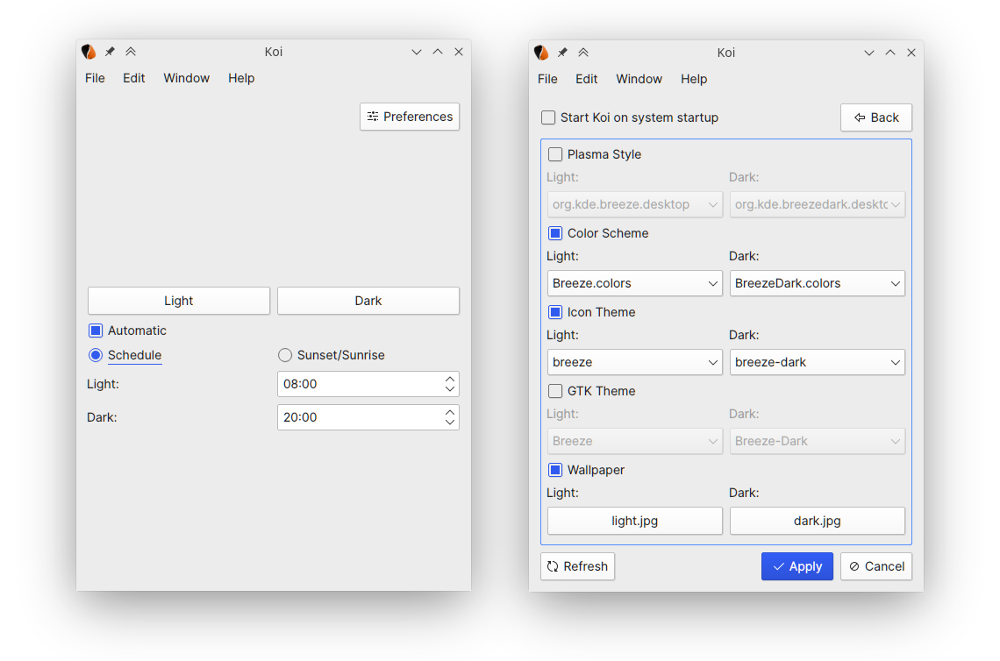

<h1 align="center">Koi</h1> 

<h3 align="center">Theme scheduling for the KDE Plasma Desktop</h3>

Koi is a program designed to provide the KDE Plasma Desktop functionality to automatically switch between light and dark themes. Koi is under active development, and while it is stable enough to use daily, expect bugs. Koi is designed to be used with Plasma, and while some features may function under different desktop environments, they are unlikely to work and untested.

**Disclaimer:** Koi was written as a project to practice Qt by a novice programmer,  expect code to be written sloppily.

### Features

- Toggle between light and dark presets based on time.
- Change Plasma style.
- Change Qt colour scheme.
- Change Icon theme.
- Change GTK theme.
- Change wallpaper.
- Hide application to system tray.

### Screenshots

### Using Koi

Koi is designed to be very simple to use. When you first open Koi, settings for the light and dark presets will be empty, all you need to do is select which themes you'd like for Koi to manage and select your desired themes by clicking the *Preferences* button. 

If you would like that Koi switch between your light and dark settings automatically, you can select this option in the main page of the program, and choose between following a user set schedule, or at sunrise and sunset (planned feature). To switch between light and dark manually right click the tray icon and select the desired preset, or do so from Koi's main window.

In order to have Koi start at login, you can do so with the Plasma System Settings. Simply navigate to *Startup and Shutdown* > *Autostart*, and select *Add Program...*. If you are to do this, I recommend that you also check the option to start Koi hidden, so not to be annoyed by Koi popping up every time you start your system.

### Get Koi

Lastest Koi version: 0.1.2 [beta]

#### Dependencies

- Qt

- Plasma

- KDE Frameworks

- qmake [build dependency]

Koi targets the latest version of the above deps. As of writing this file, these are; Qt 5.14.2, KDE Plasma 5.18.5, KDE Frameworks 5.70 and qmake 3.1.

#### Ubuntu Based 
`sudo apt update` 

`sudo apt install git g++ qtbase5-dev`

`sudo apt install  libkf5coreaddons-dev libkf5widgetsaddons-dev libkf5config-dev libkf5package-dev libkf5service-dev`

#### Arch Linux

`sudo pacman -Syu` 

`sudo pacman -S gcc` 

Install it from the [AUR](https://aur.archlinux.org/packages/koi/).

#### Other Distros

Support for AppImage dropped. Considering Flatpak.

#### Build from source

1. `git clone https://github.com/baduhai/Koi.git`

2. `cd Koi`

3. `mkdir build`

4. `cd build`

5. `qmake ../src/koi.pro`

6. `make`

7. `make install` - requires root privileges.

These instructions also apply to building the latest release version of Koi. Instead of cloning the repository, download and extract the latest *Source Code* archive, from then follow step 2 and beyond.

### References

The following is a list of resources that I used as reference and inspiration for writing Koi.

- [Yin-Yang](https://github.com/daehruoydeef/Yin-Yang) - For UI layout and features inspiration.
- [system-tray-icon-qt](https://github.com/C0D1UM/system-tray-icon-qt) - For teaching me how to implement a system tray icon with Qt.
- [plasma-theme-switcher](https://github.com/maldoinc/plasma-theme-switcher) - For teaching me how to set current Qt colour scheme.
- [ksetwallpaper](https://github.com/pashazz/ksetwallpaper) - For teaching me how to set the wallpaper on Plasma.
- [This blog post from Zren](https://zren.github.io/2020/04/28/how-to-change-plasma-icon-theme-in-the-terminal) - For teaching me how to set the icon theme.

### Contributors

<table style="width=100%">
	<tr>
		<td align="center">
			<a href="https://github.com/jandreski"><b>Jakov Andreski</b></a>
		</td>
		<td align="center">
			<a href="https://github.com/Da-Viper"><b>Da-Viper</b></a>
		</td>
	</tr>
</table>

### License

[**LGPL**](LICENSE)
