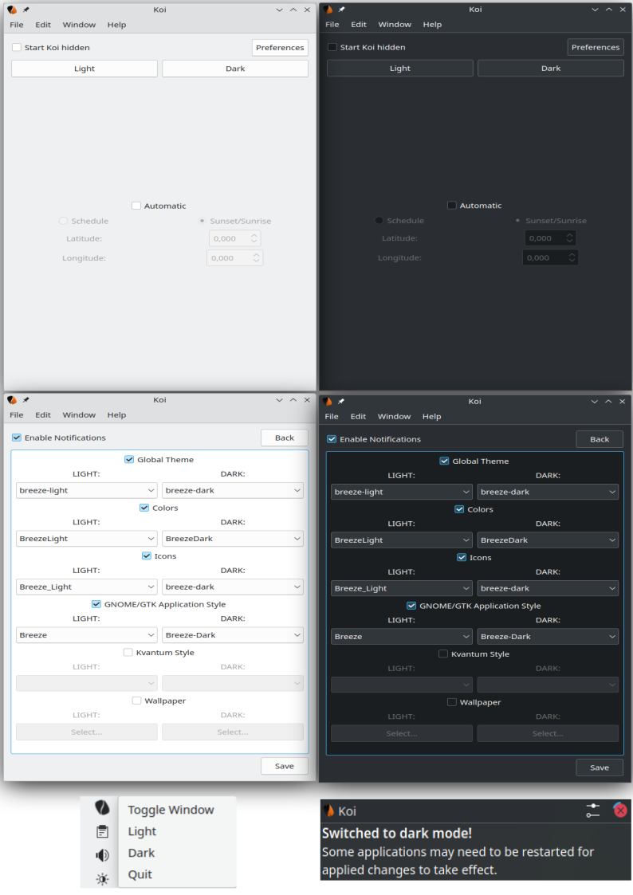

<p align="center"></p>

<h1 align="center">Koi</h1> 

<h3 align="center">Scheduling LIGHT/DARK Theme Converter for the KDE Plasma Desktop</h3>

Koi is a program designed to provide the KDE Plasma Desktop functionality to automatically switch between light and dark themes. Koi is under semi-active development, and while it is stable enough to use daily, expect bugs. Koi is designed to be used with Plasma, and while some features may function under different desktop environments, they are unlikely to work and untested.

*Koi was written as a project to practice QT by a novice programmer, expect code to be written sloppily.*

## Features

- Toggle between light and dark presets based on time.
- Change Plasma style.
- Change Qt colour scheme.
- Change Icon theme.
- Change GTK theme.
- Change wallpaper.
- Hide application to system tray.

___

## Screenshots



___

## Using Koi

Koi is designed to be very simple to use. After the initial run of Koi, settings for the **light** and **dark** presets will be empty, all you need to do is select which themes you would like for Koi to manage and select your desired themes by clicking the *Preferences* button.

If you would like that Koi switch between your light and dark settings automatically, you can select this option in the main page of the program, and choose between following a user set schedule, or at **sunrise** and **sunset** *(planned/scheduled feature)*. To switch between **light** and **dark** manually right click the tray icon and select the desired preset, or do so from Koi's main window.

#### Startup/Autostart
In order to have Koi started at login, you can do so with the *KDE Plasma System Settings*.

Search for: ***Autostart***

**Plasma** version **5** navigate to ***System Settings*** -> ***Startup and Shutdown*** -> ***Autostart***;

**Plasma** version **6** navigate to ***System Settings*** -> ***System*** -> ***Autostart***, and select "`+ Add...`"

In addition, it is recommended having the option to *Start Koi hidden* checked, this will prevent Koi from popping up every time you start your operating system.

___

## Get Koi

*Latest version: 0.3*

### Building from SOURCE

**GENERIC Dependencies**

<ins>KDE Frameworks [Development files]:</ins>

 * KF 6 Config
 * KF 6 Core Addons
 * KF 6 Widgets Addons

<ins>KDE Plasma Desktop Environment</ins>

<ins>QT [Development files]:</ins>

 * QT 6 Core
 * QT 6 DBus
 * QT 6 Gui
 * QT 6 Network
 * QT 6 Test
 * QT 6 Widgets *(Optional)*
 * QT 6 Xml *(Optional)*

<ins>CMake Program</ins>


**Build Instructions**

1. `git clone https://github.com/baduhai/Koi.git` | `git clone git@github.com:baduhai/Koi.git` | `gh repo clone baduhai/Koi`

2. `cmake -S "./Koi/src/" -B "./Koi/src/build/"`

3. `sudo make -C "./Koi/src/build/"`

4. `sudo make -C "./Koi/src/build/" install`   *# This will 'install' Koi into `/usr/local/bin/`*


***Building with NIX (OS)***

`nix-build -E 'with import <nixpkgs> {}; pkgs.libsForQt5.callPackage ./dev.nix {}'`


### Prerequisites:

### Arch Linux - [[AUR]](https://aur.archlinux.org/packages/koi/)

**Build Dependencies:**

- ``` 'gcc' 'qt6-base' 'qt6-tools' 'qt6-svg' 'cmake' 'extra-cmake-modules' ```

**Run Dependencies:**

- ``` 'plasma-desktop' 'plasma-integration' ```

### openSUSE TumbleWeed - [[OBS]](https://build.opensuse.org/package/show/KDE:Extra/koi)

**Build Dependencies:**

- ``` 'cmake' 'cmake-extras' 'kf6-kconfigwidgets-devel' 'kf6-kconfig-devel' 'kf6-kcoreaddons-devel' 'qt6-base'  'qt6-dbus-devel' 'qt6-gui-devel' 'qt6-network-devel' 'qt6-test-devel' 'qt6-widgets-devel' 'qt6-xml-devel' 'hicolor-icon-theme' ```

**Run Dependencies:**

- ``` 'plasma6-desktop' ```

### openSUSE Leap - [[OBS]](https://build.opensuse.org/package/show/KDE:Extra/koi)

**Build Dependencies:**

- ``` 'cmake' 'cmake-extras' 'kf5-kconfigwidgets-devel' 'kf5-kconfig-devel' 'kf5-kcoreaddons-devel' 'qt5-dbus-devel' 'qt5-gui-devel' 'qt5-network-devel' 'qt5-test-devel' 'qt5-widgets-devel' 'qt5-xml-devel' 'hicolor-icon-theme' ```

**Run Dependencies:**

- ``` 'plasma5-desktop' 'plasma-framework-components' 'plasma-framework-desktoptheme' ```

### Fedora - [[COPR]](https://copr.fedorainfracloud.org/coprs/birkch/Koi/)

**Build Dependencies:**

- ``` 'cmake' 'extra-cmake-modules' 'kf6-kconfigwidgets-devel'  'kf6-kconfig-devel' 'kf6-kcoreaddons-devel' 'kf6-kwidgetsaddons-devel' 'qt6-qtbase-devel' 'hicolor-icon-theme' ```

**Run Dependencies:**

- ``` 'plasma-desktop' 'plasma-integration' 'plasma-workspace' ```

### Debian/Ubuntu

**Build Dependencies:**

- ``` 'g++' 'cmake' 'cmake-extras' 'libkf5config-dev' 'libkf5coreaddons-dev' 'libkf5dbusaddons-dev' 'libkf5widgetsaddons-dev' 'qtbase5-dev' ```

**Run Dependencies:**

- ``` 'kde-plasma-desktop' 'plasma-framework' 'plasma-integration' 'plasma-workspace' ```

### KDE Neon

**Build Dependencies:**

- ``` 'g++' 'cmake' 'cmake-extras' 'libkf6config-dev' 'libkf6coreaddons-dev' 'libkf6dbusaddons-dev' 'libkf6widgetsaddons-dev' 'qtbase6-dev' ```

**Run Dependencies:**

- ``` 'kde-plasma-desktop' 'plasma-desktop' ```

### *NixOS - [[NUR]](https://nur.nix-community.org/repos/baduhai/)*

- *Install to your NIX profile with `nix-env -iA koi -f https://github.com/baduhai/nur/tarball/master`, to add to you nixos configuration, follow the [Instructions](https://github.com/nix-community/nur#installation) on the NUR repo.*

### Void Linux

**Build Dependencies:**

- ``` 'gcc' 'cmake' 'qt6-base' 'qt6-tools' 'qt6-svg' 'extra-cmake-modules' 'qt6-dbus' 'dbus-devel' 'qt6-dbus-devel' 'qt6-base-devel' 'kf6-kcoreaddons-devel' 'kf6-kconfig-devel' 'kf6-kwidgetsaddons-devel' ```

**Run Dependencies:**

- ``` 'plasma-desktop' 'plasma-integration' ```

___

## Credits:

* William Franco Abdul Hai [(baduhai)](https://github.com/baduhai)
* Martin Stibor [(Martin von Reichenberg)](https://github.com/MartinVonReichenberg)
* [ducvietcao](https://github.com/ducvietcao)
* [toboil-features](https://github.com/toboil-features)


## References

The following is a list of resources that was used as reference and inspiration for writing Koi.

- [Yin-Yang](https://github.com/daehruoydeef/Yin-Yang) - For UI layout and features inspiration.
- [system-tray-icon-qt](https://github.com/C0D1UM/system-tray-icon-qt) - For teaching me how to implement a system tray icon with Qt.
- [plasma-theme-switcher](https://github.com/maldoinc/plasma-theme-switcher) - For teaching me how to set current Qt color scheme.
- [ksetwallpaper](https://github.com/pashazz/ksetwallpaper) - For teaching me how to set the wallpaper on Plasma.
- [SunRise](https://github.com/signetica/SunRise) - For scheduled sunrise/sunset light/dark theme switching.
- [CTPL](https://github.com/vit-vit/CTPL) - Extra library for parallel job execution.
- [Scheduler](https://github.com/Bosma/Scheduler) - For timed light/dark theme switching.
- [This blog post from Zren](https://zren.github.io/2020/04/28/how-to-change-plasma-icon-theme-in-the-terminal) - For teaching me how to set the icon theme.
