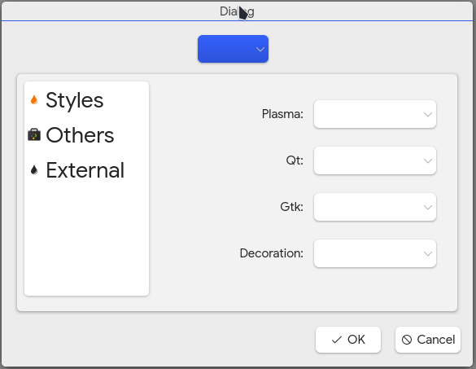

# Koi

**Theme scheduling for the KDE Plasma Desktop**

**use the all in one branch** 

  

This is a TODO list 

- [ ] rewrite the tray to show the favourites (may be with shortcuts / icons ) ;
- [ ] add a dialog box if koi is run for the first time to say it is in the tray.
- [x] add cursors style 
- [x]  add window decoration // i am having a hard time figuring out how to get all the window decoration on the system 
- [x] most of the methods in utils should be static as they have no relation to the actual class Utils and should be movedinto other classes that it is related to like plasma-style, icons etc.
   // i found a way but not sure if it is optimal tho.
- [ ] some of the classes are now useless it would either need to be deleted or used for other thing like moving some methods from the utils class into there if they are related as the utils class it too large for my liking.
- [x] include button for running scripts
- [x] make methods modular this will assist in the ability to add more than just light and dark if it is not hard-coded.  //almost done
- [ ] add ability to switch konsole terminal themes 
- [X] The ui/ux is currently a mess i am no ux/ui guy but i don't really know how to make it any better .... for now
- [x] add install directory for icons in the cmakelists 
- [x] remove redundant code 
- [x] add ability to run scripts 
- [x] make the UI better and remove redundant check boxes
- [x] fix icons not added in the desktop file and in the system
- [x] choose a formatting standard (currently digging the Microsoft one because is very easy to read
- [ ] separating logic from UI
- [ ] add switching browser styles for (for chrome, chromium and firefox)
- [ ] add support for more languages other than English with i18n/i10n 
- [x] make the favourites button work
- [ ] updating pages 
- [ ] add Global Shortcut to cycle between themes.//not yet sure on a good way to implement this.
- [ ] replace with qtStringLiteral for static data.

## **How to Build** 

NB: the app is built for the K desktop environment .

on X11 
    install xsettingsd 
   
### **Ubuntu Based ** 

##### Dependencies 

`sudo apt update` 

//qtbase5-dev is optional for kubuntu / kde neon 20.04  if it does not build add it back 

`sudo apt install git cmake ninja-build g++ extra-cmake-modules qtbase5-dev`

`sudo apt install  libkf5coreaddons-dev libkf5widgetsaddons-dev libkf5config-dev libkf5package-dev libkf5service-dev`

### Arch Based  

`sudo pacman -Syu` 

`sudo pacman -S cmake gcc extra-cmake-modules ninja` 

// I have not gotten the dependencies for other distros currently will be added later 

### From Sources.

`git clone https://github.com/Da-Viper/Koi.git`
 
`cd Koi && mkdir build && cd build` 

`cmake .. -DCMAKE_BUILD_TYPE=Release -G Ninja`

###### To run the app enter 

from the build folder 

`cd src  && ./koi` 

if you insist on installing the app   go the build folder and run 

`sudo ninja install` 

to uninstall run 

`sudo ninja uninstall`  

then you can delete the directory 

